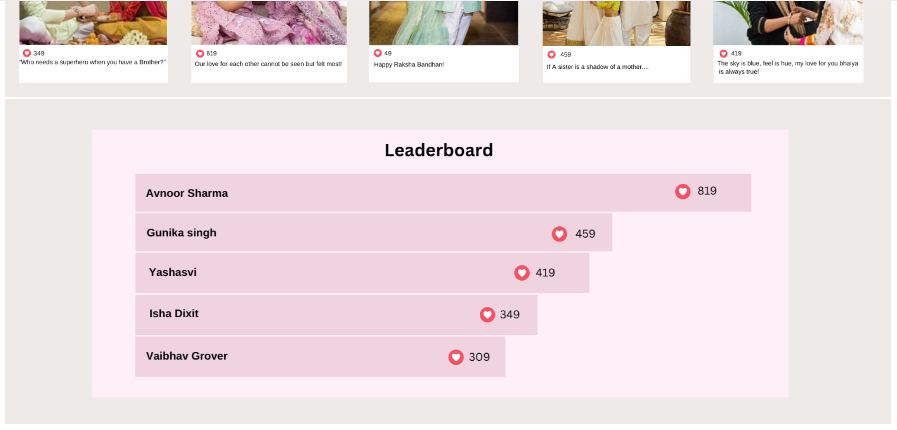

# MyntraHacker Ramp Hackathon Contest Website

Welcome to our MyntraHacker Ramp Hackathon Contest Website, designed to elevate your Myntra experience. Our platform brings you a blend of creativity and engagement through two dynamic features:
- **Contest Challenges:** Participate in exciting fashion contests and showcase your unique style.
- **Blogs:** Stay updated with the latest fashion trends, tips, and articles curated by fashion enthusiasts.

This project was created as part of the MyntraHacker Ramp Hackathon 2024, where we aimed to innovate and create engaging solutions for the Myntra platform. Our team has worked tirelessly to develop features that not only encourage user participation but also create a vibrant community of fashion lovers.

## Team Members

- [Chhavi](https://github.com/chhavii04)
- [Ridhima](https://github.com/grace)
- [Vanshika Khurana](https://github.com/vanshikhurana)

## Features

- **Contest Submission:** Participants can submit their entries showcasing their talent.
- **Voting System:** Users can like submissions, and a leaderboard is generated based on likes.
- **Prizes:** Winners are eligible for Myntra gift vouchers and fashion merchandise.
- **Responsive Design:** Ensures seamless experience across devices.
- **Database Integration:** Stores submission data securely in Firebase.
- **Blog:** Users can write and publish blogs, and read fashion tips and articles.

## Technologies Stack

- **UI Design:** Figma
- **Frontend:** HTML5, CSS3, JavaScript
- **Backend:** Node.js, Express.js
- **Database:** Firebase

## Screenshots

### Main Page

### Contest Challenge

#### Ongoing/Upcoming Page

#### Contest Page

#### Submission Page

#### Contest Dashboard

#### Leaderboard

### Blogs

#### Blog Homepage

#### Editor Window

#### Published Blogs

### Firebase Database

